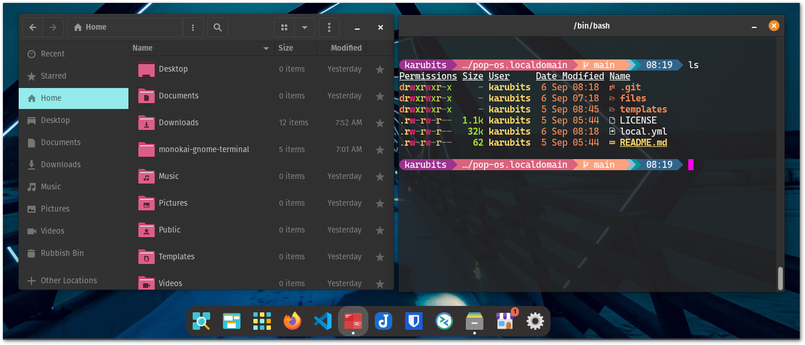

# PC Setup Playbook

A dedicated playbook for setting up my preferred POP OS Environment using Ansible. 



# How to run

1. Install python and pip
```shell
sudo apt install -y python3 python3-pip
```
2. Install ansible
```shell 
python3 -m pip install ansible 
```
3. Execute this playbook
```shell
ANSIBLE_FORCE_COLOR=true ~/.local/bin/ansible-pull -U https://github.com/karubits/pc-setup-playbook.git --ask-become-pass
```
